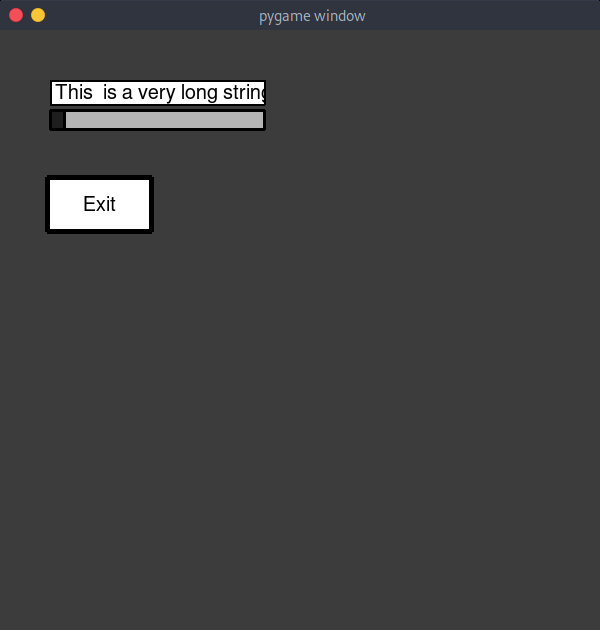
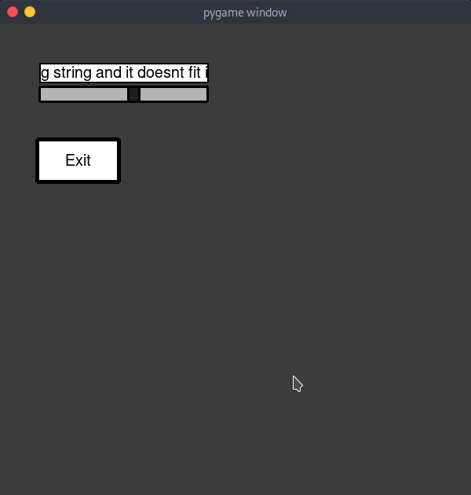

# Offset an entry's text with a Slider widget

By combining the `Entry.set_offset()` and `Slider.set_max()` methods we can read the part of the text that gets outside the Entry widget

### Code

```python
####################################################################################
# This example shows how we can use a slider to offset an entry,                   #
# which allows us to read parts of the text that are outside the widget boundaries #
####################################################################################

import pgui
import pygame
import sys

pygame.init()


class Main:
    def __init__(self):
        # Create a screen so we can display our widgets
        self.screen = pygame.display.set_mode((600, 600))

        # Create some widgets
        self.entry = pgui.Entry(self, width=215, func=self.clear)
        self.slider = pgui.Slider(self, length=200, orientation="horizontal")
        self.button = pgui.Button(self, func=sys.exit)

        # Modify some widget values
        self.button.set_label("Exit")
        self.slider.set_label("")
        self.slider.set_border_width(3)
        self.slider.set_bg_color((180, 180, 180))
        self.slider.set_pointer_color((30, 30, 30))
        self.slider.set_pointer_border_width(3)
        self.entry.set_border_width(2)

        # Move them to the location we want them to be
        self.entry.move(50, 50)
        self.slider.move(50, 80)
        self.button.move(50, 150)

        # This is optional but we can but the widgets inside a list so we can
        # then iterate through it to update the widgets
        self.widgets = [self.entry, self.button, self.slider]

    def clear(self):
        # This will clear the text in the Entry widget
        self.entry.clear()

    def update(self):
        self.screen.fill((60, 60, 60))

        # Update each widget
        for w in self.widgets:
            w.update()

        self.slider.set_max(self.entry.get_label_length()-self.entry.width+self.entry.font_size)

        if self.entry.get_label_length() > self.entry.width:
            self.entry.set_offset(self.slider.get_mark())

        # Update the screen
        pygame.display.flip()

    # We can use a separate method for event handling
    def events(self):
        # The loop does not need to have anything in it but we
        # can use it however we want
        for event in pygame.event.get():
            if event.type == pygame.QUIT:
                raise SystemExit  # This is just the same as sys.exit()
            if event.type == pygame.KEYDOWN:
                if event.key == pygame.K_ESCAPE:
                    raise SystemExit  # This is just the same as sys.exit()


main = Main()
while True:
    main.update()
    main.events()
```

### Screenshots



---



---


---

[Go back to index](../../index.md)
